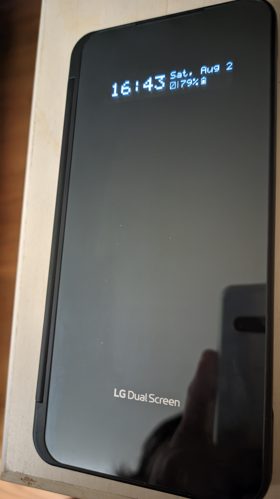
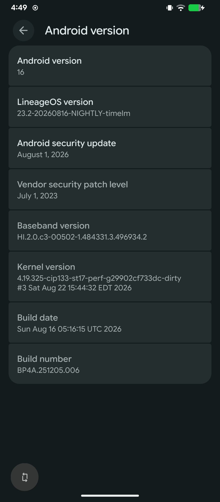
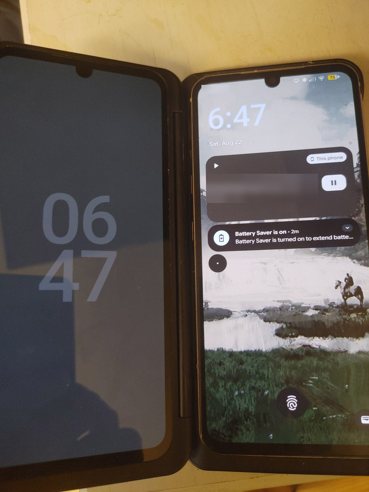

# LG Dual Screen (DS2) on LineageOS — LG V60 ThinQ

Brings LG's Dual Screen accessory back to life on LineageOS for the LG V60 ThinQ (`timelm`), as
a Magisk module: both the cover window and the second screen itself.

LineageOS ships none of LG's dual-screen userspace, so out of the box the DS2 does nothing: the
kernel enumerates it over USB and then stalls, because the process that would take it further
(`vendor.lge.hardware.dualscreen@1.1-service`) does not exist on LineageOS.

## What works

- DS2 detection, USB enumeration, and the kernel state machine reaching `DS_Ready`
- The stock LG HALs running on LineageOS: `dualscreen@1.1`, `accessory@1.1` (+ `uevent@1.2`),
  `coverdisplay@1.0`
- A framework bridge exposing `IDisplayManagerEx` as the `dualscreen_ex` binder service
- **The cover window** — the strip visible when the case is folded shut — showing clock,
  weekday/date, battery percentage with a proportional battery icon, and a no-SIM indicator
- **Hinge-driven power sequencing**: unfolding the case powers the accessory up, folding it
  powers it down, automatically
- **The DS2's main panel** — the DisplayPort link comes up and Android enumerates the second
  screen as a 1080x2460@60 external display. Both mirror and desktop mode work.
- **Touch on the second screen** — the digitizer is taken out of LPWG mode on attach and its
  input is routed to the DS2's display, so apps can be opened and used on it directly
- **Brightness tracking** — the DS2 follows the built-in panel, so the normal brightness slider
  and adaptive brightness drive both screens
- Everything starts automatically at boot


## Screenshots

The cover window on LineageOS — clock, weekday/date, battery percentage with a proportional
battery icon, and a no-SIM indicator (this unit has no SIM installed):



Running on LineageOS 23.2 (Android 16):



The kernel string in that screenshot ends in `-dirty` because that unit runs a debug kernel used
during the investigation. **The module does not require it** — it is confirmed working on a
second V60 running a completely stock LineageOS kernel.

## What does not work yet

The second screen lights up, responds to touch and runs apps, but stock still does more with it.
In short: apps cannot be *launched* onto it programmatically, and its brightness is not tied to
the main screen's.

See [TO-DO](#to-do--reaching-parity-with-stock) for the full gap list and what each would take.


## Known issue: intermittent attach

The DS2 sometimes fails to enumerate, leaving `hub failed to enable device, error -108` in the
kernel log. **Workaround: reboot.** Nothing lighter is known to clear it.

Root cause is now known, and it is a **kernel workqueue deadlock**, confirmed from live blocked-task
stacks rather than inferred:

When the DS2 is already attached at power-on, `lge_ds3` reaches `DS_Startup` at ~1.041s, but
`dp_display_probe()` only registers the DisplayPort USBPD SVID handler at ~1.045s. That 4ms miss
makes `ds_dp_config()` return `-ENODEV`, and its error path calls `stop_2nd_usb_host()` just 82µs
after `start_2nd_usb_host()`. dwc3 therefore tears the xHCI host down while the hub is still
enumerating the DS2; `hub_quiesce()` blocks forever, `dwc3_otg_sm_work` wedges, and
`dwc3_resume_work` then blocks flushing it. Because `dwc3_wq` is an *ordered* workqueue, every
subsequent USB ID event is queued behind the blocked one and never runs — so the controller is
permanently deaf until reboot.

**A fix is available and validated:**
[`kernel/0001-lge_ds3-retry-ds_dp_config-on-ENODEV.patch`](kernel/0001-lge_ds3-retry-ds_dp_config-on-ENODEV.patch)
retries across the registration window instead of tearing the host down. It is **not part of the
Magisk module** — the module runs fine on a stock kernel, and this bug is not reachable from
userspace.

Tested across repeated cold boots with the DS2 attached from power-on (the condition that
triggers it): every run reached `DS_Ready` with zero `error -108`, no `DS_Recovery_*` cycling, no
blocked workers, and a complete DisplayPort link. See [`kernel/README.md`](kernel/README.md) for
how to apply and verify it, [`docs/problem-a-blocked-tasks.txt`](docs/problem-a-blocked-tasks.txt)
for the raw deadlock stacks, and [`docs/dualscreen-attach-flow.md`](docs/dualscreen-attach-flow.md)
for the full derivation.

## Installing

Requires an LG V60 ThinQ (`timelm`) running LineageOS, rooted with Magisk.

1. Get `lge_ds2_hal_shim.zip` — from the Releases page, or build it yourself (below)
2. Install it: Magisk app → Modules → Install from storage, or
   `adb shell su -c 'magisk --install-module /sdcard/Download/lge_ds2_hal_shim.zip'`
3. Reboot

Verify:

```sh
adb shell su -c 'lshal | grep -E "dualscreen|accessory|coverdisplay"'
adb shell 'service list | grep dualscreen_ex'
adb shell su -c 'tail -20 /data/local/tmp/ds2_shim.log'
```

Fold the case shut and the cover window should show the clock.

**If it hangs at the LG logo**: power off, then hold Volume Down from the moment the logo appears
until the boot animation — that is Magisk safe mode and disables all modules for one boot.

A hang caused by a malformed VINTF fragment happens late enough that `adbd` is running, so you can
often `touch /data/adb/modules/lge_ds2_hal_shim/disable` over adb instead. Do not rely on that in
general: a failure earlier in boot leaves no adb at all, and safe mode is the only way back.

## Using the second screen

**Desktop mode must be enabled in Developer options first.** Without it the second screen is
only offered as a mirror, and Android will not treat it as a display that can host its own
windows.

Settings → System → Developer options → **Force desktop mode on secondary displays**, then
reboot. Equivalent over adb:

```sh
adb shell settings put global force_desktop_mode_on_external_displays 1
adb reboot
```

(The exact wording of the toggle varies a little between LineageOS builds — look for "desktop
mode" among the developer options. The `settings` key above is the one that actually matters.)

With that set, attaching the Dual Screen brings up the display prompt:


- **Mirror** duplicates the main screen. This works well.
- **Desktop** treats the DS2 as an independent display. The display itself works, but see
  *What does not work yet* above — touch routing and launching apps onto it are still incomplete.

Both panels running under LineageOS, the DS2 on the left showing the clock:



## TO-DO — reaching parity with stock

The module currently gets the DS2 *lit and usable*. Stock does considerably more. This is what
is missing, roughly in order of how tractable it looks.

Everything below is reachable through HAL methods the module **already has running** unless noted
— `lshal` shows the full `IDualScreen` surface, and much of it is simply not called yet.

### 1. Touch input on the second screen — **DONE**

Two separate things had to be right, and the second one is the interesting bug.

**Routing.** `module/system/vendor/usr/idc/Vendor_1004_Product_637a.idc` binds the digitizer to
the external display. Confirmed applied, and `local:4` is confirmed correct:

```text
Touch Input Mapper (mode - DIRECT):
  DeviceType: TOUCH_SCREEN
  AssociatedDisplay: isExternal=true, displayId='local:4'
  OrientationAware: true
```

**Waking the digitizer.** LG's touch controllers run in U0 (sleep / knock-on gestures only) or U3
(normal reporting). The DS2's comes up in **U0 on every attach**, and nothing in LineageOS tells
it otherwise — so the panel lights up and the digitizer stays mute.

The symptoms point everywhere except the real cause:

```text
getTouchFirmwareVersion  -> status=0, v3.34, product id [B3W68DS3]
getSelfTest              -> status=0, "Raw Data : Pass / Channel Status : Pass"
getGpiopin               -> status=0, reset_pin=1 (out of reset), int_pin=1
hid-multitouch           -> binds, creates input nodes with correct axis ranges
/dev/hidraw0             -> blocks forever, not one report
```

`DoTouchReset()`, `set_touch_perf(true)` and `ds_update_state()` all return success and change
nothing. What actually works is handing the controller the screen state:

```java
LpwgStatus st = new LpwgStatus();
st.lpwgMode = LpwgMode.DISABLE;
st.screenStatus = ScreenStatus.ON;
hal.setStatus(st);          // -> 0, and the digitizer starts reporting
```

`TouchEnabler` does this, and `DualScreenBridgeDaemon` calls it on every DS2 attach (plus once at
startup, for the case where the DS2 was already attached before the daemon ran). It has to run per
attach, not once — the controller returns to U0 each time.

`TouchProbe` and `AtProbe` are kept as standalone diagnostics for `IDualScreen@1.0`.

### 2. Brightness — **DONE**

Android's slider only drives the built-in panel, and the DS2 is an ordinary external display with
no control surface, so it used to sit at whatever level it powered on with. `BrightnessSync`
polls `panel0-backlight` and mirrors it through `IDualScreen.setBrightness()`, which makes the
normal UI slider and adaptive brightness control both screens.

Notes for anyone touching it:

- `panel0-backlight-ex` is **vestigial** — it accepts writes and its `actual_brightness` stays 0.
  It is neither a usable source nor sink. The live value is `panel0-backlight`.
- Resolve the HAL proxy **once**. Calling `IDualScreen.getService()` per update costs a
  service-manager lookup each time and is visible as lag when the slider moves.
- The DS2 forgets its brightness across a power cycle, so the sync has to be re-pushed on attach
  rather than relying on a cached "last value" comparison.
- `DS2_MAX` is an empirical constant. The HAL range-checks nothing — it returns 0 for values well
  past any plausible maximum — so it cannot be derived, only calibrated by eye.

### 3. Launching apps onto the DS2

`am start --display N` requires the `INTERNAL_SYSTEM_WINDOW` signature permission. **Root does not
satisfy it** — this is the one item here that cannot be solved from a Magisk module alone. Options,
none yet attempted:

- a small system-signed helper APK (needs a signature the platform accepts)
- a Xposed/LSPosed module hooking the launch path
- patching `services.jar` directly

### 4. Display geometry

`getCoverDisplayCutout()` and `getSubDisplayInfo()` are unused. Stock uses these to describe the
DS2's cutout and dimensions to the window manager. Without them, layout on the second screen is
whatever Android infers from a generic external display.

### 5. Rotation and orientation

Stock keeps the two panels' orientation coupled and rotates the DS2 sensibly when the phone is
turned. Nothing here handles that; the IDC sets `touch.orientationAware = 1` but the display side
is untouched.

### 6. Wide mode / spanning

Stock can treat both panels as one logical surface for apps that support it
(`getWideScreenMode()` appears in the framework surface). Not investigated at all.

### 7. Ergonomics stock has and this does not

- swapping the running app between panels with a gesture
- a launcher/home experience on the DS2 rather than whatever Android puts there
- LG's Dual Screen settings UI
- the virtual gamepad overlay

### 8. Attach reliability

**Done** — see *Known issue* above. The kernel patch under [`kernel/`](kernel/) is validated on
hardware across repeated cold boots. Remaining work here is confirming it on more devices than
the two it was developed against.

## Building

This repository does **not** contain LG's proprietary binaries (the release archive does — see
*Licensing and contents*). To build from source you supply them from firmware you own:

```sh
./tools/extract-blobs.sh /path/to/mounted/stock/vendor   # or: --adb, from a stock-running device
./tools/build.sh
```

`extract-blobs.sh` pulls 21 files (3 HAL services, 4 passthrough impls, 13 vendor libs). Note
they exist only in LG's **stock** vendor partition — if you have already converted to LineageOS,
extract them from an LG KDZ firmware image rather than from the running device.

`build.sh` compiles the Java bridge, dexes it, validates the VINTF fragments and shell scripts,
and assembles the zip. See the comments in it for the two environment variables you need to set.

The optional kernel patch under [`kernel/`](kernel/) is built separately against a LineageOS
`timelm` kernel tree — see [`kernel/README.md`](kernel/README.md).

### Repository layout

```text
module/     the Magisk module: scripts, VINTF fragments, init .rc files, IDC
src/        the framework bridge (Java, compiled to dualscreen-bridge.dex)
tools/      blob extraction and the module build
kernel/     optional kernel patch for the intermittent-attach deadlock
docs/       the full reverse-engineering write-up and raw evidence
```

## Licensing and contents

- Original work here (`CoverDisplayPowerBridge`, `CoverWindowRenderer`, `TinyFont`,
  `DualScreenBridgeDaemon`, the module scripts, the VINTF fragments, the docs) is under the
  license in [`LICENSE`](LICENSE).
- `SubLcdController.java` is **derived from LG's stock `services.jar`** (decompiled and adapted).
  It is included because the bridge cannot work without it. It is not original work and is not
  covered by that license.
- The HAL binaries and `vendor.lge.hardware.*` libraries are **LG proprietary**. They are not
  committed to this repository — the git tree contains no blobs — but the **release archive
  bundles them** so the module is installable without extracting them yourself. They remain LG's
  copyrighted work and are not covered by the license above. If you would rather not use a
  redistributed copy, [`tools/extract-blobs.sh`](tools/extract-blobs.sh) pulls them from firmware
  you own and `tools/build.sh` assembles an equivalent zip.

## Credits

Reverse-engineered from stock LG firmware by inspecting the HAL binaries, decompiling
`framework.jar` / `services.jar`, and comparing kernel behaviour between stock and LineageOS on
real hardware. The key discovery for the power path was that
`CoverDisplayPowerManagerService` — absent from LineageOS entirely — drives
`IAccessory.setCoverDisplayButtonStatus()`, which makes the accessory HAL natively power the DS2.

The attach-reliability bug was then root-caused by reading blocked-task stacks out of a live,
wedged kernel rather than by reasoning about the driver source, which is what finally
distinguished a deadlock from the "controller never started" theory that had held for a long time
and was wrong.
