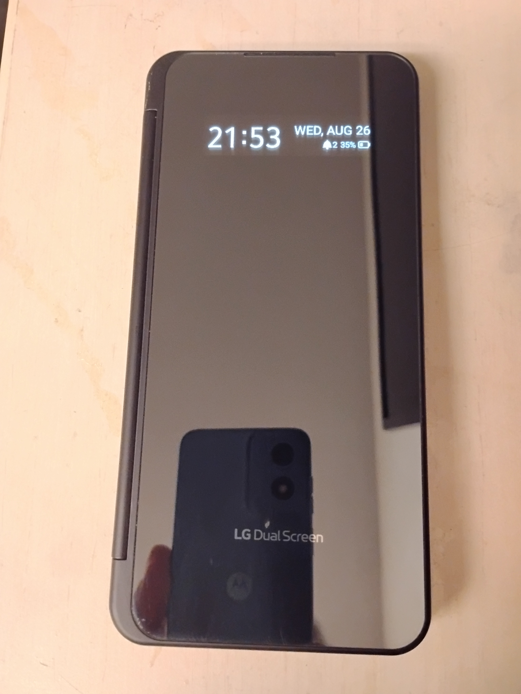
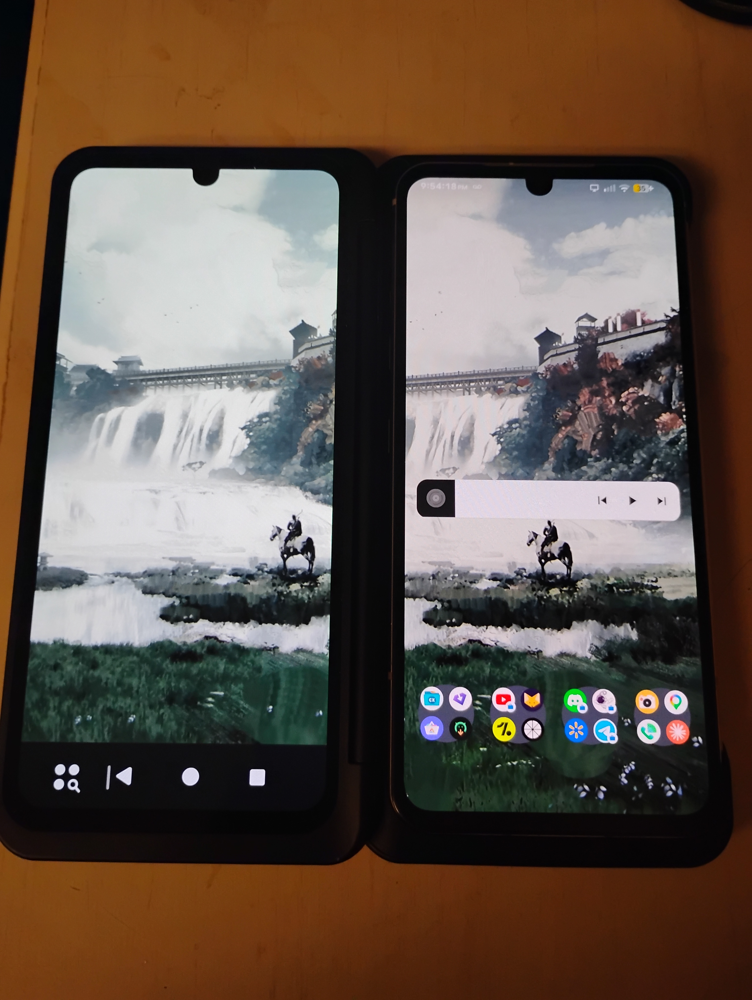
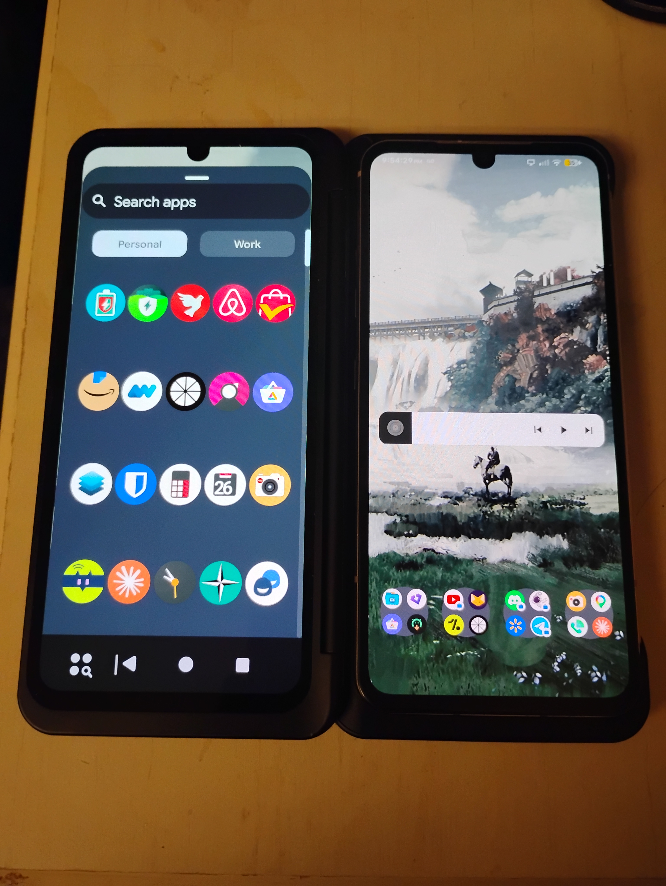
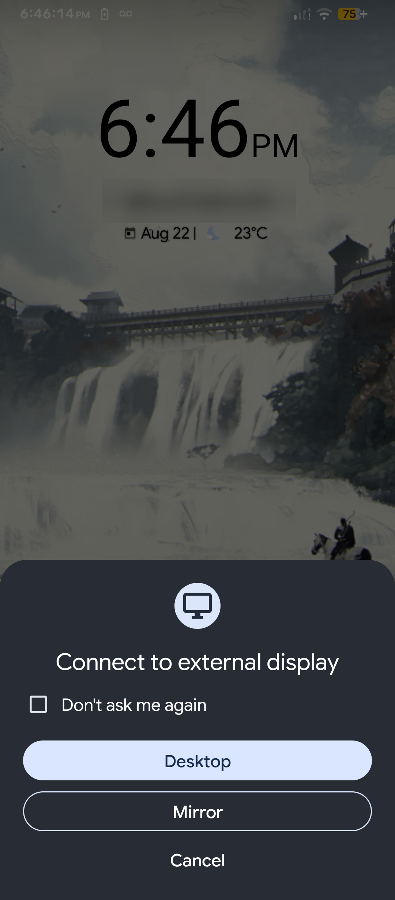

# LG Dual Screen (DS2) on LineageOS — LG V60 ThinQ

Brings LG's Dual Screen accessory back to life on LineageOS for the LG V60 ThinQ (`timelm`), as
a Magisk module: both the cover window and the second screen itself.

LineageOS ships none of LG's dual-screen userspace, so out of the box the DS2 does nothing: the
kernel enumerates it over USB and then stalls, because the process that would take it further
(`vendor.lge.hardware.dualscreen@1.1-service`) does not exist on LineageOS.

## What works

- DS2 detection, USB enumeration, and the kernel state machine reaching `DS_Ready`
- The stock LG HALs running on LineageOS: `dualscreen@1.1`, `accessory@1.1` (+ `uevent@1.2`),
  `coverdisplay@1.0`
- A framework bridge exposing `IDisplayManagerEx` as the `dualscreen_ex` binder service
- **The cover window** — the strip visible when the case is folded shut — showing clock,
  weekday/date, battery percentage with a proportional battery icon, a no-SIM indicator, and a
  notification count, drawn in LG's own font with Stock's metrics
- **Hinge-driven power sequencing**: unfolding the case powers the accessory up, folding it
  powers it down, automatically
- **The DS2's main panel** — the DisplayPort link comes up and Android enumerates the second
  screen as a 1080x2460@60 external display
- **Touch on the second screen** — the digitizer is taken out of LPWG mode on attach and its
  input is routed to the DS2's display, so apps can be opened and used on it directly
- **Launching apps on the DS2** — tap an icon in the DS2 taskbar's app drawer and it launches
  fullscreen, same as tapping one on the main screen. A static overlay and a patched Trebuchet
  make this work; see [`docs/taskbar-launch-blocker.md`](docs/taskbar-launch-blocker.md) for how
- **Navigation on the DS2** — its own taskbar with a working All Apps button, and back/home/
  recents that each do what they say (home in particular needed its own fix — SystemUI's home
  key handling ignores which display asked for it)
- **The DS2's app drawer matches the main screen's** — 5 columns without a name label under
  every icon, not the denser 6-column labeled grid the DS2's higher reported density otherwise
  picks for the identical panel
- **Brightness tracking** — the DS2 follows the built-in panel, so the normal brightness slider
  and adaptive brightness drive both screens
- **Dual-screen screenshots** — Power+VolDown produces one image containing both panels
- Everything starts automatically at boot


## Screenshots

The cover window on LineageOS — clock, weekday/date, battery percentage with a proportional
battery icon, and a no-SIM indicator (this unit has no SIM installed):



Both panels running under LineageOS, home screen on the left, the DS2's own launcher on the
right:



The DS2's app drawer, 5 columns without labels to match the main screen:



Launching apps, navigating, and switching profiles on the DS2:

https://github.com/user-attachments/assets/0ce8388e-5fa9-4902-abed-4c9c56c9242a

The unit in these shots runs a debug kernel used during the investigation (its version string
ends in `-dirty`). **The module does not require it** — it is confirmed working on a second V60
running a completely stock LineageOS kernel.

## What does not work yet

The second screen lights up, responds to touch, and both launches and navigates apps normally
now — but stock still does more with it: freeform/multi-window on the DS2 (deliberately not
offered, see *Using the second screen* below), coupled screen rotation, wide-mode/spanning, and
moving a running app between screens from the shell (investigated, withdrawn — see TO-DO §3).

See [TO-DO](#to-do--reaching-parity-with-stock) for the full gap list and what each would take.


## Known issue: intermittent attach

The DS2 sometimes fails to enumerate, leaving `hub failed to enable device, error -108` in the
kernel log. **Workaround: reboot.** Nothing lighter is known to clear it.

Root cause is now known, and it is a **kernel workqueue deadlock**, confirmed from live blocked-task
stacks rather than inferred:

When the DS2 is already attached at power-on, `lge_ds3` reaches `DS_Startup` at ~1.041s, but
`dp_display_probe()` only registers the DisplayPort USBPD SVID handler at ~1.045s. That 4ms miss
makes `ds_dp_config()` return `-ENODEV`, and its error path calls `stop_2nd_usb_host()` just 82µs
after `start_2nd_usb_host()`. dwc3 therefore tears the xHCI host down while the hub is still
enumerating the DS2; `hub_quiesce()` blocks forever, `dwc3_otg_sm_work` wedges, and
`dwc3_resume_work` then blocks flushing it. Because `dwc3_wq` is an *ordered* workqueue, every
subsequent USB ID event is queued behind the blocked one and never runs — so the controller is
permanently deaf until reboot.

**A fix is available and validated:**
[`kernel/0001-lge_ds3-retry-ds_dp_config-on-ENODEV.patch`](kernel/0001-lge_ds3-retry-ds_dp_config-on-ENODEV.patch)
retries across the registration window instead of tearing the host down. It is **not part of the
Magisk module** — the module runs fine on a stock kernel, and this bug is not reachable from
userspace.

Tested across repeated cold boots with the DS2 attached from power-on (the condition that
triggers it): every run reached `DS_Ready` with zero `error -108`, no `DS_Recovery_*` cycling, no
blocked workers, and a complete DisplayPort link. See [`kernel/README.md`](kernel/README.md) for
how to apply and verify it, [`docs/problem-a-blocked-tasks.txt`](docs/problem-a-blocked-tasks.txt)
for the raw deadlock stacks, and [`docs/dualscreen-attach-flow.md`](docs/dualscreen-attach-flow.md)
for the full derivation.

## Installing

Requires an LG V60 ThinQ (`timelm`) running LineageOS, rooted with Magisk.

1. Get `lge_ds2_hal_shim-v0.4.zip` — from the Releases page, or build it yourself (below)
2. Install it: Magisk app → Modules → Install from storage, or
   `adb shell su -c 'magisk --install-module /sdcard/Download/lge_ds2_hal_shim-v0.4.zip'`
3. Reboot

That single zip is everything — the overlay and the patched launcher it carries are placed into
`/product` and `/system_ext` by the module itself at boot. There is no separate APK to install,
open, or grant permissions to.

Verify:

```sh
adb shell su -c 'lshal | grep -E "dualscreen|accessory|coverdisplay"'
adb shell 'service list | grep dualscreen_ex'
adb shell su -c 'tail -20 /data/local/tmp/ds2_shim.log'
```

Fold the case shut and the cover window should show the clock.

**If it hangs at the LG logo**: power off, then hold Volume Down from the moment the logo appears
until the boot animation — that is Magisk safe mode and disables all modules for one boot.

A hang caused by a malformed VINTF fragment happens late enough that `adbd` is running, so you can
often `touch /data/adb/modules/lge_ds2_hal_shim/disable` over adb instead. Do not rely on that in
general: a failure earlier in boot leaves no adb at all, and safe mode is the only way back.

### Recommended: the ds3 attach-reliability kernel patch

The module works on a completely stock kernel, but the DS2 will occasionally fail to enumerate on
that kernel — `hub failed to enable device, error -108` in the log, cleared only by a reboot (see
*Known issue* above). It's a genuine kernel deadlock, not something the module can work around
from userspace, and the fix is a one-line-of-behavior kernel patch that has been validated across
repeated cold boots with zero recurrences. Recommended for daily use; skip it if you'd rather not
touch the kernel, at the cost of an occasional reboot-to-fix.

1. Get the LineageOS `timelm` kernel source and apply the patch:
   ```sh
   cd /path/to/timelm/kernel
   patch -p1 < kernel/0001-lge_ds3-retry-ds_dp_config-on-ENODEV.patch
   ```
2. Build it and produce a `boot.img` the normal way for this device/kernel tree.
3. **Magisk-patch that `boot.img`** (Magisk app → Install → Select and Patch a File), so root
   survives — do this even if you're already rooted, since a freshly built `boot.img` has no
   Magisk ramdisk of its own yet.
4. Flash the patched image. Whichever way you get it onto the device, **back up the current boot
   partition first**:
   ```sh
   adb shell getprop ro.boot.slot_suffix                      # e.g. _b
   adb shell "su -c 'dd if=/dev/block/bootdevice/by-name/boot_b of=/sdcard/boot_backup.img bs=4M'"
   adb pull /sdcard/boot_backup.img                            # off the device, somewhere safe
   ```
   Then either flash normally through fastboot (`fastboot flash boot_b magisk_patched.img`), or,
   if the phone won't enter fastboot via `adb reboot bootloader` (it doesn't on some V60 units),
   write it directly from a rooted shell — this is what Magisk's own Direct Install does:
   ```sh
   adb push magisk_patched.img /data/local/tmp/
   adb shell "su -c 'dd if=/data/local/tmp/magisk_patched.img of=/dev/block/bootdevice/by-name/boot_b bs=4M && sync'"
   ```
5. Reboot **with the Dual Screen attached from power-on** — that's the specific condition that
   triggers the bug, so it's also the only way to confirm the patch actually caught it. Expect no
   `error -108` in the log this time.

If a flash goes wrong, restore from `boot_backup.img` the same way (swap `if=`/`of=` in the `dd`
command above) — from a rooted shell if you still have adb, or via fastboot from the backup if not.

Full derivation, the exact blocked-task stacks that identified the deadlock, and more detail on
each step above: [`kernel/README.md`](kernel/README.md) and
[`docs/dualscreen-attach-flow.md`](docs/dualscreen-attach-flow.md).

## Using the second screen

No developer-option toggle needed — the module sets what that toggle would have set
(`persist.wm.debug.desktop_experience_devopts`) itself, every boot, since it's the only way to
turn on a flag this build doesn't otherwise expose a route to (see
[`docs/taskbar-launch-blocker.md`](docs/taskbar-launch-blocker.md)). Just attach the Dual Screen
and it comes up with the display prompt:



- **Mirror** duplicates the main screen. This works well.
- **Desktop** hosts its own windows on the DS2 — tap an icon in its taskbar's app drawer and it
  launches fullscreen, with a working All Apps button and back/home/recents underneath. Freeform
  windowing itself is deliberately *not* offered here: the module ships a static overlay
  (`config_isDesktopModeSupported=false`) that stops the desktop-mode stack from ever trying to
  build a freeform window on the DS2, because this hardware cannot create one and the attempt
  used to fail every app launch silently. What that overlay would otherwise disable — the
  Taskbar and its launch path — is restored by a companion patch to Trebuchet (the launcher).
  See [`docs/taskbar-launch-blocker.md`](docs/taskbar-launch-blocker.md) for the full trace of
  why, and both fixes are one Magisk module, not something you install separately.

## Changelog

**v0.4** (2026-08-28)

- **DS2 no longer goes dark after lock/unlock** — the DS2 lives in its own display group with
  its own wakefulness, and nothing ever woke it back up after the device slept, even though the
  accessory itself never lost power. Fixed by waking that display group directly and resetting
  its activity timeout, the same way the built-in panel's own wake path does. See
  [`docs/taskbar-launch-blocker.md`](docs/taskbar-launch-blocker.md) for the diagnosis and the
  two approaches that were tried and ruled out first
- **DS2 rotates with the app, not stuck on one orientation** — the DS2 was permanently pinned to
  a single rotation regardless of what was on screen (a fullscreen video, for instance, never
  went landscape), because LineageOS only ever marks the built-in panel as "rotates with
  content." Overridden per-display at runtime, with no framework patch needed
- **DS2 powers off when the case folds shut** — previously only the outer cover strip reacted to
  the hinge; the DS2's main panel stayed fully lit the entire time the accessory was attached,
  fold or not, which was a real, needless battery drain. The two are now always exact opposites:
  case closed → strip on, DS2 panel off; case open → strip off, DS2 panel on

**v0.3** (2026-08-26)

- **Launching apps on the DS2** — tapping an icon in the DS2 taskbar's app drawer used to do
  nothing. Root-caused to four separate points that each independently dropped the launch (an
  aconfig flag this build doesn't ship, a UI-controller branch that only ever no-ops without an
  Overview, a rule that routed any external-display launch into a freeform desk this hardware
  can't create, and connected-display taskbar auto-stash hiding the bar with no way back); fixed
  with a static overlay plus a five-point Trebuchet dex patch. See
  [`docs/taskbar-launch-blocker.md`](docs/taskbar-launch-blocker.md) for the full trace
- **DS2 taskbar decluttered** — the 3 folders that were mirrored in from the phone's own
  home-screen hotseat no longer show on the DS2's taskbar; the pins themselves and the main
  screen are untouched
- **DS2 home button fixed** — it silently did nothing, because SystemUI's key-event home
  handling resolves home against the default display regardless of which display asked for it.
  Now starts that display's own home directly from Trebuchet instead, bypassing the SystemUI
  call
- **One module** — the desktop-experience fix above and the HAL shim used to be two separate
  Magisk modules; they're now one (`lge_ds2_hal_shim`), so there's a single thing to install and
  a single thing to disable if something goes wrong
- **No Developer options step** — the module now sets
  `persist.wm.debug.desktop_experience_devopts` itself every boot, which the DS2 Taskbar needs to
  exist at all on this build. This was previously left set from earlier debugging on the test
  phone rather than shipped, so a genuinely fresh install would have booted to a DS2 with no
  Taskbar and no clue why
- **DS2 app drawer matches the main screen** — 5 columns without labels, not the denser
  6-column labeled grid its higher reported density otherwise resolves to for the identical
  panel. A `wm density` override was tried first and reverted — it fixes the grid but also
  breaks the All Apps button's touch target

**v0.2** (2026-08-24)

- **Touch on the second screen** — the digitizer is taken out of LPWG (gesture-only) mode on
  every attach, so apps can be opened and used on the DS2 directly (see TO-DO §1 for the
  diagnosis)
- **Dual-screen screenshots** — Power+VolDown produces one image containing both panels
- **Cover window** — real text rendered in LG's font with Stock's metrics, and a notification
  count above the clock
- **Brightness tracking** — the DS2 follows the built-in panel live, following Stock's
  brightness policy rather than mirroring the panel's backlight register, with a perceptual
  (gamma) curve so the slider feels right (TO-DO §2)
- **Attach reliability** — the intermittent `error -108` attach failure is root-caused as a
  kernel workqueue deadlock and a fix is available, validated across repeated cold boots
  (see *Known issue*)

**v0.1** (2026-08-22)

- First release: DS2 detection and enumeration, the stock LG HALs on LineageOS, the framework
  bridge, the cover window (clock/date/battery/no-SIM, drawn with a bitmap font), hinge-driven
  power sequencing, and the second screen over DisplayPort in mirror and desktop mode

## TO-DO — reaching parity with stock

The module currently gets the DS2 *lit and usable*. Stock does considerably more. This is what
is missing, roughly in order of how tractable it looks.

Everything below is reachable through HAL methods the module **already has running** unless noted
— `lshal` shows the full `IDualScreen` surface, and much of it is simply not called yet.

### 1. Touch input on the second screen — **DONE**

Two separate things had to be right, and the second one is the interesting bug.

**Routing.** `module/system/vendor/usr/idc/Vendor_1004_Product_637a.idc` binds the digitizer to
the external display. Confirmed applied, and `local:4` is confirmed correct:

```text
Touch Input Mapper (mode - DIRECT):
  DeviceType: TOUCH_SCREEN
  AssociatedDisplay: isExternal=true, displayId='local:4'
  OrientationAware: true
```

**Waking the digitizer.** LG's touch controllers run in U0 (sleep / knock-on gestures only) or U3
(normal reporting). The DS2's comes up in **U0 on every attach**, and nothing in LineageOS tells
it otherwise — so the panel lights up and the digitizer stays mute.

The symptoms point everywhere except the real cause:

```text
getTouchFirmwareVersion  -> status=0, v3.34, product id [B3W68DS3]
getSelfTest              -> status=0, "Raw Data : Pass / Channel Status : Pass"
getGpiopin               -> status=0, reset_pin=1 (out of reset), int_pin=1
hid-multitouch           -> binds, creates input nodes with correct axis ranges
/dev/hidraw0             -> blocks forever, not one report
```

`DoTouchReset()`, `set_touch_perf(true)` and `ds_update_state()` all return success and change
nothing. What actually works is handing the controller the screen state:

```java
LpwgStatus st = new LpwgStatus();
st.lpwgMode = LpwgMode.DISABLE;
st.screenStatus = ScreenStatus.ON;
hal.setStatus(st);          // -> 0, and the digitizer starts reporting
```

`TouchEnabler` does this, and `DualScreenBridgeDaemon` calls it on every DS2 attach (plus once at
startup, for the case where the DS2 was already attached before the daemon ran). It has to run per
attach, not once — the controller returns to U0 each time.

`TouchProbe` and `AtProbe` are kept as standalone diagnostics for `IDualScreen@1.0`.

### 2. Brightness — **DONE**

`BrightnessSync` follows the policy Stock implements in `CoverDisplayPowerController`, rather
than simply mirroring the main panel.

Stock gives the DS2 its own persisted brightness in
`Settings.Secure.screen_brightness_for_coverdisplay`, with
`Settings.Secure.global_screen_brightness_mode` deciding whether that value tracks the main screen
or is set independently. Both are honoured here, defaulting to "follow" since neither exists on a
LineageOS install.

Two things worth taking from Stock rather than deriving:

- **The DS2's range is 0..255** — Stock's `clampAbsoluteBrightness()` is literally
  `MathUtils.constrain(value, 0, 255)`.
- **Stock feeds it the brightness *setting*, not the panel's backlight register.** These are
  different numbers: `panel0-backlight` runs 0..365 with the main panel's curve already applied,
  so scaling that into 0..255 applies the curve twice.

Notes for anyone touching it:

- `panel0-backlight-ex` is **vestigial** — it accepts writes and its `actual_brightness` stays 0.
  It is neither a usable source nor sink. The live value is `panel0-backlight`.
- Resolve the HAL proxy **once**. Calling `IDualScreen.getService()` per update costs a
  service-manager lookup each time and is visible as lag when the slider moves.
- The DS2 forgets its brightness across a power cycle, so the sync has to be re-pushed on attach
  rather than relying on a cached "last value" comparison.
- `DS2_MAX` is an empirical constant. The HAL range-checks nothing — it returns 0 for values well
  past any plausible maximum — so it cannot be derived, only calibrated by eye.

### 3. Launching and moving apps between screens — **investigated, withdrawn**

**Note:** this item is about a different mechanism than ordinary launching. Tapping an icon in
the DS2's own taskbar is the normal path and works as of v0.3 — see the changelog and
[`docs/taskbar-launch-blocker.md`](docs/taskbar-launch-blocker.md). What follows is specifically
about the privileged `am start --display` / `am display move-stack` shell commands, kept
withdrawn for the reason below.

The mechanism works and is not permission-blocked. This was previously listed as needing the
`INTERNAL_SYSTEM_WINDOW` signature permission; that was wrong, and measured from `adb shell`
(uid 2000). `ActivityManagerService.checkComponentPermission` grants unconditionally to uid 0, so
from a root process both of these work:

```sh
am start --display <id> -n <pkg>/<activity>    # launch onto a screen
am display move-stack <taskId> <displayId>     # move a running app across
```

**It is deliberately not shipped.** Moving tasks between displays can strand the lockscreen on the
DS2, at which point the fingerprint reader is on the wrong panel and the phone cannot be unlocked.
That is a bad failure for a convenience feature, and the trigger for it is not yet well enough
understood to ship safely.

The implementation (`DisplaySwap.java`) is kept out of tree for whoever picks this up.
Note the DS2's display id is **not stable** — it has been observed as both 2 and 4 across
attaches, so it has to be resolved fresh each time rather than cached.

### 4. Display geometry

`getCoverDisplayCutout()` and `getSubDisplayInfo()` are unused. Stock uses these to describe the
DS2's cutout and dimensions to the window manager. Without them, layout on the second screen is
whatever Android infers from a generic external display.

### 5. Rotation and orientation

Stock keeps the two panels' orientation coupled and rotates the DS2 sensibly when the phone is
turned. Nothing here handles that; the IDC sets `touch.orientationAware = 1` but the display side
is untouched.

### 6. Wide mode / spanning

Stock can treat both panels as one logical surface for apps that support it
(`getWideScreenMode()` appears in the framework surface). Not investigated at all.

### 7. Ergonomics stock has and this does not

- swapping the running app between panels with a gesture
- a launcher/home experience on the DS2 rather than whatever Android puts there
- LG's Dual Screen settings UI
- the virtual gamepad overlay

### 8. Attach reliability

**Done** — see *Known issue* above. The kernel patch under [`kernel/`](kernel/) is validated on
hardware across repeated cold boots. Remaining work here is confirming it on more devices than
the two it was developed against.

## Building

This repository does **not** contain LG's proprietary binaries (the release archive does — see
*Licensing and contents*). To build from source you supply them from firmware you own:

```sh
./tools/extract-blobs.sh /path/to/mounted/stock/vendor   # or: --adb, from a stock-running device
./tools/build.sh
```

`extract-blobs.sh` pulls 21 files (3 HAL services, 4 passthrough impls, 13 vendor libs). Note
they exist only in LG's **stock** vendor partition — if you have already converted to LineageOS,
extract them from an LG KDZ firmware image rather than from the running device.

`build.sh` compiles the Java bridge, dexes it, validates the VINTF fragments and shell scripts,
and assembles the zip. See the comments in it for the two environment variables you need to set.

The optional kernel patch under [`kernel/`](kernel/) is built separately against a LineageOS
`timelm` kernel tree — see [`kernel/README.md`](kernel/README.md).

### Repository layout

```text
module/     the Magisk module: scripts, VINTF fragments, init .rc files, IDC
src/        the framework bridge (Java, compiled to dualscreen-bridge.dex)
app/        source for the RRO and the Trebuchet dex patch (tools/build.sh folds both into module/)
tools/      blob extraction and the module build
kernel/     optional kernel patch for the intermittent-attach deadlock
docs/       the full reverse-engineering write-up and raw evidence
```

## Licensing and contents

- Original work here (`CoverDisplayPowerBridge`, `CoverWindowRenderer`, `TinyFont`,
  `DualScreenBridgeDaemon`, the module scripts, the VINTF fragments, the docs) is under the
  license in [`LICENSE`](LICENSE).
- `module/fonts/font_lg_smart_ui_number_regular.ttf` is **LG's font**, taken from their
  `LGSubDisplay` app so the clock matches Stock. 3.4KB, digits and punctuation only. Same
  copyright status as the HAL binaries.
- `SubLcdController.java` is **derived from LG's stock `services.jar`** (decompiled and adapted).
  It is included because the bridge cannot work without it. It is not original work and is not
  covered by that license.
- The HAL binaries and `vendor.lge.hardware.*` libraries are **LG proprietary**. They are not
  committed to this repository — the git tree contains no blobs — but the **release archive
  bundles them** so the module is installable without extracting them yourself. They remain LG's
  copyrighted work and are not covered by the license above. If you would rather not use a
  redistributed copy, [`tools/extract-blobs.sh`](tools/extract-blobs.sh) pulls them from firmware
  you own and `tools/build.sh` assembles an equivalent zip.
- `DS2DesktopFix.apk` (the RRO, under `app/ds2-desktopfix-rro/`) is original work, built entirely
  from the source in this repository, and is under the license in [`LICENSE`](LICENSE).
  `Launcher3QuickStep.apk` in the release archive is **AOSP's Trebuchet, patched** — a handful of
  bytecode edits (`app/ds2-launchfix/patch_smali.py` documents each one) applied to LineageOS's
  build of it and re-signed with a throwaway key. Like the HAL binaries, the patched apk itself
  is not committed — the git tree carries only the patch script and the build step that applies
  it to a stock copy pulled from the phone.

## Credits

Reverse-engineered from stock LG firmware by inspecting the HAL binaries, decompiling
`framework.jar` / `services.jar`, and comparing kernel behaviour between stock and LineageOS on
real hardware. The key discovery for the power path was that
`CoverDisplayPowerManagerService` — absent from LineageOS entirely — drives
`IAccessory.setCoverDisplayButtonStatus()`, which makes the accessory HAL natively power the DS2.

The attach-reliability bug was then root-caused by reading blocked-task stacks out of a live,
wedged kernel rather than by reasoning about the driver source, which is what finally
distinguished a deadlock from the "controller never started" theory that had held for a long time
and was wrong.
